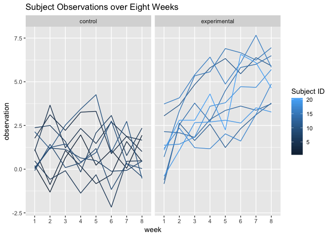
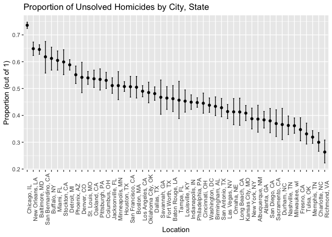

Homework 5, Amelia Grant-Alfieri, ag3911
================

# Problem 1

## Tidy Dataframe

Tidy dataframe should include data from all participants, including the
subject ID, arm, and observations over time:

``` r
library(tidyverse)
library(dplyr)
library(tidyr)
library(purrr)
library(readr)
library(data.table)

csv_files = list.files(path = ".", pattern = "*.csv")
csv_files
```

    ##  [1] "con_01.csv" "con_02.csv" "con_03.csv" "con_04.csv" "con_05.csv"
    ##  [6] "con_06.csv" "con_07.csv" "con_08.csv" "con_09.csv" "con_10.csv"
    ## [11] "exp_01.csv" "exp_02.csv" "exp_03.csv" "exp_04.csv" "exp_05.csv"
    ## [16] "exp_06.csv" "exp_07.csv" "exp_08.csv" "exp_09.csv" "exp_10.csv"

``` r
p1 = csv_files %>%
  map(read_csv) %>%
  janitor::clean_names() %>%
  reduce(rbind) %>%
  mutate(arm = 1:20) %>%
  mutate(ID = 1:20) %>%
  mutate(arm = as.character(arm)) %>%
  mutate(arm = if_else(arm == 1:10, "control", "experimental")) %>%
  gather(key = week, value = "observation", week_1:week_8) %>%
  separate(week, into = c("delete", "week"), sep = "_") %>%  
  select(-delete) 
```

## Plot observations of each subject over time

Make a spaghetti plot showing observations on each subject over time,
and comment on differences between groups.

``` r
library(ggplot2)
p1 %>%
  ggplot(aes(x = week, y = observation, group = ID, color = ID)) + geom_line() + labs(title = "Subject Observations over Eight Weeks", color = "Subject ID")  + facet_grid(.~ arm)
```

<!-- -->

In general, the subjects in the experimental group have higher values
compared to those of the subjects in the control group. Also, within the
experimental group, subject values generally increase over the course of
eight weeks while subject values in the control group maintain
relatively similar values at the start and end of the 8-week period. In
both the experimental and control groups, most values fluctuate from
week to week.

# Problem 2

## Tidy Data

The raw data includes the following information: the case ID number; the
date of the homicide; the victim’s first name, last name, race, and sex;
the location of the homicide by city, state, latitude, and longitude;
and the disposition (open/no arrest, closed by arrest, closed without
arrest).

``` r
library(tidyverse)
library(rvest)
library(httr)
library(tidyr)
library(stringr)
library(dplyr)

tidy = read_csv("./data/homicide-data.csv") %>%
  mutate(city_state = str_c(city, ", ", state))   #make new variable that combines city and state
```

## Summarize

Summarize within each city to obtain the total number of homicides and
the number of unsolved homicides (those for which the disposition is
“Closed without arrest” or “Open/No arrest”).

``` r
#Total number of homicides per city
total = tidy %>%
  group_by(city_state) %>%
  summarise(n = n())

#Number of unsolved homicides per city
unsolved = tidy %>%
  filter(disposition == "Closed without arrest" | disposition == "Open/No arrest") %>%
  group_by(city_state) %>%
  summarise(n = n())

joined = inner_join(unsolved, total, by = "city_state")
```

## Estimate proportion of unsolved homicides in Baltimore, MD

``` r
baltimore = filter(joined, joined$city_state == "Baltimore, MD") 
prop_unsolv_baltimore = prop.test(baltimore$n.x, baltimore$n.y) %>%
  broom::tidy(prop_unsolv_baltimore) %>%
  select(estimate, conf.low, conf.high)
```

## Estimate proportion of unsolved homicides in each city

``` r
library(purrr)
library(tidyverse)
library(broom)

all_city_prop = joined %>%
  mutate(output = map2(.x = n.x, .y = n.y, ~prop.test(.x, .y) %>%
                    broom::tidy(all_city_prop) %>%
                    select(estimate, conf.high, conf.low))) %>%    
                    unnest()
```

## Plot estimate and confidence interval for each city’s proportion of unsolved homicides

``` r
library(ggplot2)

plot = all_city_prop %>%
  group_by(city_state) %>%
  #mutate(estimate = as.numeric(estimate)) %>%
  #arrange(city_state, desc(estimate)) %>%
  ggplot(aes(x = reorder(city_state, -estimate) , y = estimate)) + geom_errorbar(aes(ymin = conf.low, ymax = conf.high, width = 0.2)) + geom_point() + labs(x = "Location", y = "Proportion (out of 1)", title = "Proportion of Unsolved Homicides by City, State") + theme(axis.text.x = element_text(angle = 90))
plot
```

<!-- -->
